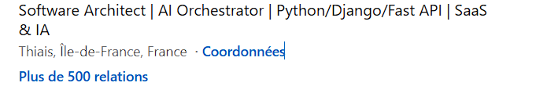

Software Architect & AI Orchestrator (Bac+5 / RNCP 6)

 

J’accompagne la conception et le développement de solutions logicielles en combinant architecture logicielle, Python (Django, PyQt6) et intelligence artificielle générative (LLMs).

 

Mon approche : utiliser l’IA comme levier d’accélération tout en garantissant des systèmes fiables, maintenables et scalables.

 

🚀 Ce que je réalise concrètement :

 • Développement de solutions SaaS et dashboards data

 • Automatisation de traitements et analyse de données (Python)

 • Conception d’applications Web et Desktop

 

⚙️ Compétences clés :

 Architecture logicielle, orchestration de modèles IA, data processing, développement multi-plateforme

 

🤝 Je suis ouvert aux opportunités (alternance, CDI ou missions) autour de projets IA, data et architecture logicielle.

