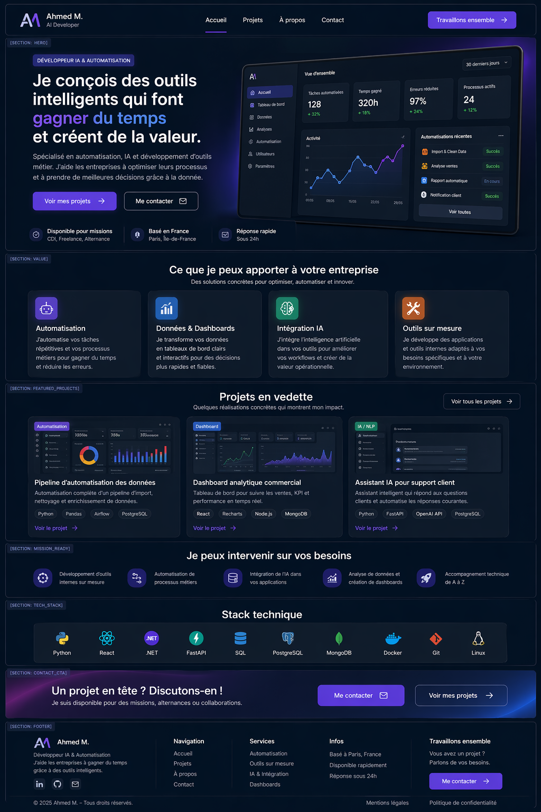
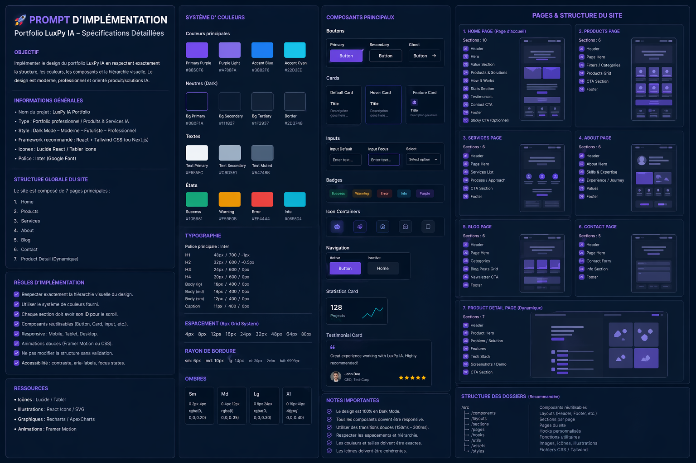

# Prompt d’implémentation — Portfolio produit IA / SaaS

## Objectif

Tu dois implémenter un portfolio professionnel orienté **vente de services et produits IA**, en te basant sur les **images de design fournies** comme source visuelle principale.

Le résultat attendu n’est **pas un simple site personnel**, mais un **portfolio produit** capable de :

- présenter une expertise claire
- vendre des services IA / automatisation / développement SaaS
- mettre en avant des produits et cas d’usage
- convertir un visiteur en prospect ou client

Le design fourni doit être interprété comme une **maquette Figma-like**, donc l’implémentation doit rester :

- propre
- modulaire
- fidèle à la hiérarchie visuelle
- facile à maintenir
- cohérente avec les capacités réelles du HTML/CSS/React

---

## Règle fondamentale

**Le design doit être implémenté comme un vrai système UI, pas comme une image décorative.**

Cela signifie :

- respecter la structure `Layout > Section > Component`
- éviter les effets artistiques non codables
- transformer chaque bloc visible en composant réutilisable
- conserver une cohérence proche d’un design system Figma

---

## Stack recommandée

Implémentation recommandée :

- **React**
- **Tailwind CSS**
- optionnel : **Next.js**
- icônes : **Lucide React**
- animations légères : **Framer Motion**
- police : **Inter**
- graphiques si besoin : **Recharts**

Si une autre stack est demandée plus tard, conserver exactement la même architecture UI.

---

## Structure globale du site

Le portfolio est composé de **7 pages principales**.

### 1. Home page
Page principale de conversion.

### 2. Products page
Page listant les produits, outils, mini-SaaS et solutions.

### 3. Services page
Page orientée offre de services.

### 4. About page
Page de présentation professionnelle et positionnement.

### 5. Blog page
Page de contenu, articles, réflexion produit, IA, automatisation.

### 6. Contact page
Page dédiée à la prise de contact.

### 7. Product Detail page
Page dynamique dédiée à un produit précis.

---

## Architecture UI globale

Chaque page suit cette logique :

```text
PAGE
 ├── LAYOUT
 │    ├── HEADER
 │    ├── MAIN
 │    │    ├── SECTION
 │    │    │    ├── COMPONENT
 │    │    │    ├── COMPONENT
 │    │    │    └── COMPONENT
 │    └── FOOTER


 
Je peux maintenant te faire une **version encore plus forte**, sous forme de vrai document prêt à donner à une IA ou à un développeur, avec :

- `arbres des pages`
- `liste exacte des composants`
- `naming conventions`
- `structure des dossiers React`
- `ordre d’implémentation`

pour que ce soit directement exploitable.

